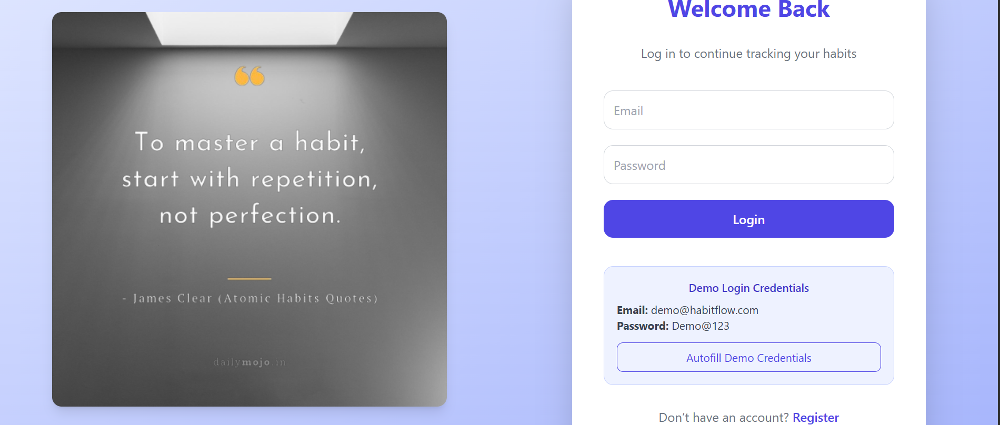
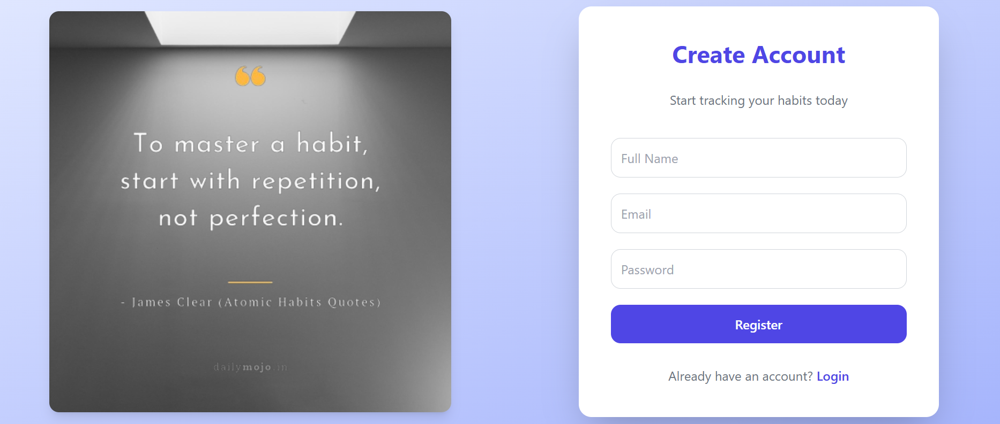
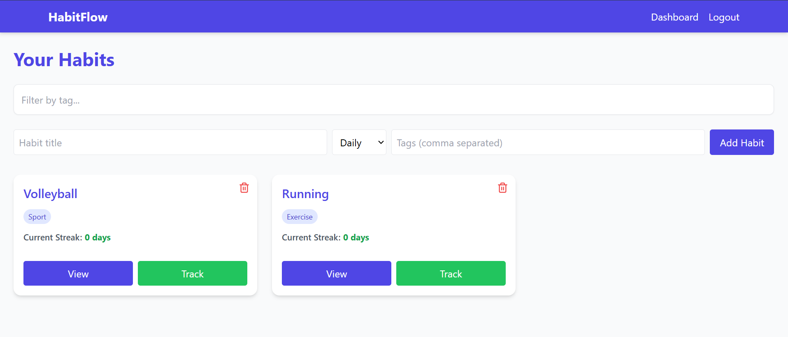
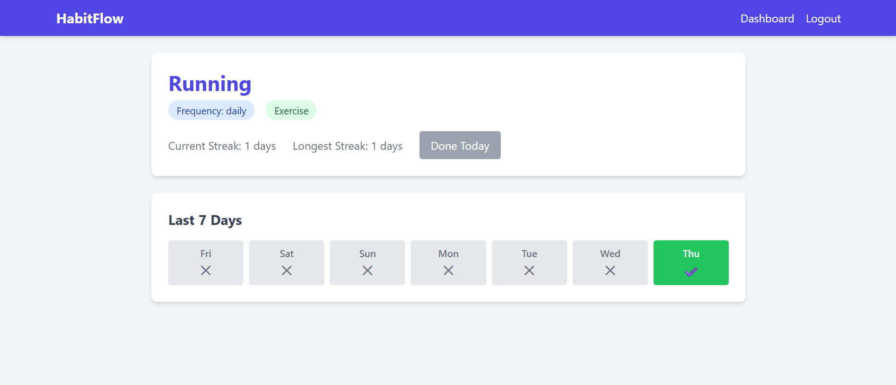

## 🧠 Habit Tracker

A full-stack Habit Tracking Application built with React, Shadcn UI, Node.js, Express, PostgreSQL, and JWT Authentication.
This app helps users build better habits, track progress, and maintain streaks — all through a clean and modern UI.

# ✨ Features
## 👤 Authentication

Secure user registration and login using JWT

Passwords hashed with bcrypt

Protected routes for authenticated users only

## 📅 Habit Management

Create, update, and delete personal habits

Track daily progress and completion

View detailed habit information and statistics

## 📊 Streaks & Progress

Track habit streaks automatically

Visual indicators for completed and pending days

## 🎨 Modern UI

Built using Shadcn UI + TailwindCSS

Responsive, minimal, and visually appealing design

Dynamic components and smooth transitions

## 🖼️ Screenshots

### 🔐 Login Page

### 🔐 Register

### 📊 Dashboard

### 🧩 Habit Details

## 🏗️ Tech Stack
Layer	Technology  
Frontend	React + JavaScript + Shadcn UI + TailwindCSS  
Backend	Node.js + Express  
Database	PostgreSQL (via Prisma ORM)  
Auth	JSON Web Tokens (JWT)  
Hosting	(Optional: Render / Vercel / Railway)  

# ⚙️ Installation & Setup
## 1️⃣ Clone the Repository
    git clone https://github.com/yourusername/habit-tracker.git
      cd habit-tracker

## 2️⃣ Setup the Backend
    cd server
    npm install

## Create a .env file:
DATABASE_URL="postgresql://<username>:<password>@localhost:5432/<dbname>?schema=public"
JWT_SECRET="your_jwt_secret"
PORT=5000
## Initialize Prisma:
    npx prisma migrate dev --name init
## Start the backend:
    npm run dev
# 3️⃣ Setup the Frontend
    cd ../client
    npm install
    npm run dev
# 🔐 API Endpoints
Method	Endpoint	Description	Auth Required  
POST	/api/auth/register	Register new user	❌   
POST	/api/auth/login	Login user & get JWT	❌  
GET	/api/habits	Get all habits for logged-in user	✅  
POST	/api/habits	Create a new habit	✅  
GET	/api/habits/:id	Get specific habit details	✅  
PUT	/api/habits/:id	Update habit details	✅  
DELETE	/api/habits/:id	Delete a habit	✅  

## 🧠 Future Enhancements

📈 Analytics Dashboard (weekly/monthly progress)  

🔔 Daily Reminders / Notifications  

🌙 Dark Mode  

🪄 Social login (Google, GitHub)  

🎯 Gamification (badges, XP, streak achievements)  

## 🧑‍💻 Author

  Ayan Khan
📧 mohammad.ayan9450@gmail.com

